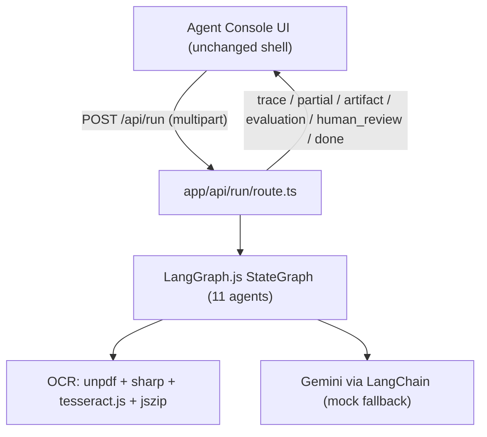

# Work Permit Intelligence Agent — Approach & Setup

This document explains **how the problem was approached**, **how it was solved**, and **how to set the project up locally from the GitHub repo**.

---

## 1. The problem

Leistenschneider Personaldienstleistungen GmbH recruits international workers. HR staff manually open emails, download documents, read work permits, check the document type, verify expiry dates, validate the issuing authority, judge authenticity, and record everything by hand. This is slow, repetitive, and error-prone.

**Goal:** automate document *validation* (reading, extracting, checking, scoring) while the **final hiring/legal decision stays with a human**. The AI only provides extracted data, confidence scores, and recommendations.

---

## 2. How I approached it

### 2.1 Pinned the constraints first

Before writing code, the requirements were narrowed to a concrete, buildable shape through a few decisions:

| Decision | Choice | Why |
|----------|--------|-----|
| Language | **100% TypeScript/JavaScript** | Required — no Python anywhere |
| Orchestration | **LangChain.js + LangGraph.js** | Required, multi-agent workflow |
| LLM | **Google Gemini only** | The single allowed paid dependency |
| Everything else | **Free / open-source** | OCR, parsing, hosting all free |
| Frontend | **Reuse the `anounman/reusable-web-ui` shell** | "Use this UI only, nothing else" |
| Persistence | **Stateless** (no DB / auth / history) | Simplest path; matches the shell exactly |
| Delivery | **End-to-end vertical slice first** | A runnable upload → result flow, then refine |

### 2.2 Mapped the task onto the existing UI shell

The shell is a **task-agnostic AI agent console**. It already has chat, file upload, an agent-trace panel, an artifact panel, an evaluation panel, and human-review controls. It talks to one endpoint — `POST /api/run` — and renders a **stream of events** (`trace`, `partial`, `artifact`, `evaluation`, `human_review`, `done`).

So instead of building a custom dashboard, the strategy was:

- **Don't redesign the UI.** Only edit the files the shell's `INSTRUCTIONS.md` permits.
- **Build a backend** in the *same* Next.js app that speaks the shell's event contract.



### 2.3 Designed a "hybrid" AI layer

To guarantee the app **always runs and demos** — even with no API key and no network — every AI agent has two paths:

- **Real path:** Gemini via LangChain, with strict JSON prompts validated by Zod schemas.
- **Mock fallback:** deterministic heuristics that run real regex/keyword analysis on the OCR text (not random output).

The boundary picks the real path when `GOOGLE_API_KEY` is set, and falls back automatically on any failure.

---

## 3. How I solved it

### 3.1 Frontend — adapted the shell (not rebuilt)

Cloned `anounman/reusable-web-ui` into the repo and edited **only** these files:

- `lib/taskConfig.ts` — branding ("Work Permit Intelligence Agent"), Gemini label, `taskId`, copy, feature flags.
- `lib/types.ts` — added a `work_permit` artifact type.
- `components/ArtifactRenderer.tsx` — added one `WorkPermitCard` renderer (document type + classification %, extracted fields, expiry countdown with 30/60/90-day badges, risk/confidence/OCR meters, validation status, AI reasoning).
- `lib/mockEvents.ts` — work-permit dev samples (valid / expiring / suspicious / unknown) + offline fallback.
- `app/globals.css` — accent color only (enterprise blue).

### 3.2 Backend — 11-agent LangGraph pipeline

Added to the same Next.js app:

- **`app/api/run/route.ts`** — parses the multipart upload (with size/count limits), runs the workflow, and streams NDJSON. Always ends with `done`; any error becomes one safe `error` event.
- **`lib/agents/`** — a typed LangGraph `StateGraph` with 11 nodes:

  ```
  Upload → OCR → Language → Classification → Extraction →
  Validation → Risk → Expiry → Recommendation → Notification → Analytics
  ```

  Includes conditional routing (unknown/low-confidence docs skip straight to a safe recommendation), confidence propagation, an OCR retry, and error recovery.
- **`lib/ai/`** — Gemini client (LangChain), prompt templates with hallucination guards ("use null if not present"), Zod output schemas, and the deterministic mock.
- **`lib/ocr/`** — `unpdf` for digital PDF text, `sharp` + `tesseract.js` for image/photo OCR (with a binarized retry on low confidence), `jszip` for archives, and multi-page merging.

### 3.3 Safety & correctness

- **Hallucination guards:** Zod-validated structured outputs; invalid responses retried once, then rejected to a safe fallback.
- **Human-in-the-loop:** review controls appear when the AI is uncertain, risk is high, or a document is expired/incomplete.
- **No chain-of-thought leaked:** only a safe workflow trace is streamed.
- **Prompt-injection scan** over extracted text (treated as data, never instructions).
- **Stateless:** uploads are processed in memory, not stored — minimizing personal-data retention.

### 3.4 Verified

- `npm run build` — clean, zero type errors.
- `npm test` — 27/27 Vitest tests pass (expiry math, classification/extraction/validation/risk, Zod guards, OCR + ZIP, full pipeline stream contract).
- Live `POST /api/run` smoke tests for valid / expiring / suspicious / unknown / empty inputs — each streams the full agent trace, a `work_permit` artifact, an evaluation, a human-review signal when warranted, and a final `done`.

---

## 4. Local setup from the GitHub repo

> Prerequisites: **Node.js 20+** (works on 18+), npm, and git.

### Step 1 — Clone the repo

```bash
git clone <YOUR_REPO_URL> work-permit-agent
cd work-permit-agent
```

### Step 2 — Install dependencies

```bash
npm install
```

This installs the shell (Next.js, React, Tailwind, Framer Motion) plus the AI/OCR stack (LangChain.js, LangGraph.js, `@langchain/google-genai`, `tesseract.js`, `unpdf`, `sharp`, `jszip`, `zod`).

### Step 3 — Configure environment (optional)

The app runs **without any key** using the deterministic offline pipeline. To use real Gemini:

```bash
# copy the template
cp .env.example .env.local      # Windows PowerShell: copy .env.example .env.local
```

Then edit `.env.local` and set your key (free at <https://aistudio.google.com/app/apikey>):

```env
GOOGLE_API_KEY=your_key_here
GEMINI_MODEL=gemini-2.5-flash
OCR_LANGS=eng+deu
```

### Step 4 — Run the dev server

```bash
npm run dev
```

Open <http://localhost:3000>.

### Step 5 — Try it

- Open the **Dev samples** menu in the composer to run offline scenarios (valid / expiring / suspicious / unknown), **or**
- Generate sample permit PDFs and upload one:

  ```bash
  npm run samples       # writes sample_data/permits/*.pdf
  ```

### Step 6 — Run the tests (optional)

```bash
npm test
```

### Step 7 — Production build (optional)

```bash
npm run build
npm run start         # serves on http://localhost:3000
```

---

## 5. Useful commands

| Command | What it does |
|---------|--------------|
| `npm run dev` | Start the dev server (hot reload) |
| `npm run build` | Production build + type check |
| `npm run start` | Run the production server |
| `npm test` | Run the Vitest suite |
| `npm run samples` | Generate synthetic sample permit PDFs |

---

## 6. Quick API smoke test

With the server running:

```bash
curl -N -X POST http://localhost:3000/api/run \
  -F "message=Validate this permit" \
  -F "task_id=work_permit_validation" \
  -F "files=@sample_data/permits/01-valid-work-permit.pdf;type=application/pdf"
```

You should see a stream of NDJSON `trace` lines, a `work_permit` `artifact`, an `evaluation`, and a final `{"type":"done"}`.

---

## 7. Where things live

```
app/api/run/route.ts     # streaming backend endpoint
components/               # shell UI + WorkPermitCard renderer
lib/taskConfig.ts         # task branding/flags (edited shell file)
lib/types.ts              # shell types + work_permit artifact (edited)
lib/mockEvents.ts         # offline fallback + dev samples (edited)
lib/agents/               # LangGraph: state, 11 nodes, graph, run, expiry
lib/ai/                   # Gemini client, prompts, Zod schemas, mock
lib/ocr/                  # unpdf, sharp, tesseract, zip, orchestrator
sample_data/              # sample permit generator + output
tests/                    # Vitest suite
docs/                     # architecture, deployment, this approach doc
```

---

## 8. Disclaimer

This tool provides AI-assisted analysis to support human reviewers. It does **not** make legal determinations about a person's right to work. All hiring and compliance decisions remain with qualified HR staff. Sample documents are synthetic.
