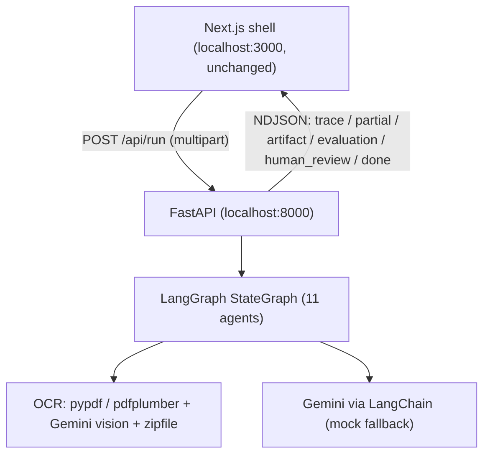

# Work Permit Intelligence Agent — Approach & Setup

This document explains **how the problem was approached**, **how it was solved**, and **how to set the project up locally**.

---

## 1. The problem

Leistenschneider Personaldienstleistungen GmbH recruits international workers. HR staff manually open emails, download documents, read work permits, check the document type, verify expiry dates, validate the issuing authority, judge authenticity, and record everything by hand. This is slow, repetitive, and error-prone.

**Goal:** automate document *validation* (reading, extracting, checking, scoring) while the **final hiring/legal decision stays with a human**. The AI only provides extracted data, confidence scores, and recommendations.

---

## 2. How I approached it

### 2.1 Pinned the constraints

| Decision | Choice | Why |
|----------|--------|-----|
| Backend | **Python 3 + FastAPI** | Standalone, local, simple to run |
| Orchestration | **LangGraph + LangChain** | Multi-agent workflow |
| LLM | **Google Gemini only** | The single allowed paid dependency |
| OCR | **`pypdf`/`pdfplumber`** (PDFs) + **Gemini vision** (images) | Pure pip, no system binaries, no model downloads |
| Everything else | **Free / open-source** | |
| Frontend | **Reuse the `anounman/reusable-web-ui` shell** | "Use this UI only, nothing else" |
| Persistence | **Stateless** (no DB / auth / history) | Matches the shell exactly |
| Infra | **No Docker, fully local, two processes** | Easiest to run and review |

### 2.2 Mapped the task onto the existing UI shell

The shell is a **task-agnostic AI agent console** with chat, file upload, an agent-trace panel, an artifact panel, an evaluation panel, and human-review controls. Crucially, it is built to call an **external backend** via `NEXT_PUBLIC_API_URL` and render a **stream of events** (`trace`, `partial`, `artifact`, `evaluation`, `human_review`, `done`).

So the strategy was:

- **Don't redesign the UI.** Only edit the files the shell's `INSTRUCTIONS.md` permits, and point it at the backend with `.env.local`.
- **Build a separate Python backend** that speaks the shell's event contract.



### 2.3 Designed a "hybrid" AI layer

To guarantee the app **always runs and demos** — even with no API key and no network — every AI agent has two paths:

- **Real path:** Gemini via LangChain, with strict JSON prompts validated by Pydantic schemas.
- **Mock fallback:** deterministic heuristics that run real regex/keyword analysis on the OCR text (not random output).

The boundary picks the real path when `GOOGLE_API_KEY` is set, and falls back automatically on any failure.

---

## 3. How I solved it

### 3.1 Frontend — adapted the shell (not rebuilt)

Edited **only** these files (per the shell's `INSTRUCTIONS.md`):

- `lib/taskConfig.ts` — branding ("Work Permit Intelligence Agent"), Gemini label, `taskId`, copy, feature flags.
- `lib/types.ts` — added a `work_permit` artifact type.
- `components/ArtifactRenderer.tsx` — added one `WorkPermitCard` renderer (document type + classification %, extracted fields, expiry countdown with 30/60/90-day badges, risk/confidence/OCR meters, validation status, AI reasoning).
- `lib/mockEvents.ts` — work-permit dev samples (valid / expiring / suspicious / unknown) + offline fallback.
- `app/globals.css` — accent color only (enterprise blue).
- `.env.local` — points the shell at the Python backend (`NEXT_PUBLIC_API_URL`).

### 3.2 Backend — 11-agent LangGraph pipeline (Python FastAPI)

- **`backend/app/main.py`** — FastAPI app with CORS for the shell, `GET /health`, and `POST /api/run`. Parses the multipart upload (size/count limits), then returns a `StreamingResponse` of NDJSON. Any error becomes one safe `error` event; the stream always ends with `done`.
- **`backend/app/agents/`** — a typed LangGraph `StateGraph` with 11 nodes:

  ```
  Upload → OCR → Language → Classification → Extraction →
  Validation → Risk → Expiry → Recommendation → Notification → Analytics
  ```

  Includes conditional routing (unknown/low-confidence docs skip straight to a safe recommendation), confidence propagation, and error recovery. Node names carry a `_step` suffix to avoid LangGraph's "name collides with a state channel" error.
- **`backend/app/ai/`** — Gemini client (LangChain `with_structured_output`), prompt templates with hallucination guards ("use null if not present"), Pydantic output schemas, and the deterministic mock.
- **`backend/app/ocr/`** — `pypdf`/`pdfplumber` for digital PDF text, **Gemini vision** for image/photo OCR (with `Pillow` preprocessing), stdlib `zipfile` for archives, and multi-page/multi-file merging with confidence weighting.

### 3.3 Safety & correctness

- **Hallucination guards:** Pydantic-validated structured outputs; invalid responses retried once, then rejected to a safe fallback; enum fields snapped to allowed values.
- **Human-in-the-loop:** review signal emitted when the AI is uncertain, risk is high, or a document is expired/incomplete.
- **No chain-of-thought leaked:** only a safe workflow trace is streamed.
- **Prompt-injection scan** over extracted text (treated as data, never instructions).
- **Stateless:** uploads are processed in memory, not stored — minimizing personal-data retention.
- **CORS** restricted to the local frontend; the Gemini key stays in the backend.

### 3.4 Verified

- Backend imports + LangGraph compiles cleanly; `uvicorn` serves `/health` and `/api/run`.
- `pytest` — 27/27 tests pass (expiry math, classification/extraction/validation/risk heuristics, Pydantic guards, OCR + ZIP, full pipeline stream contract).
- Live `POST /api/run` smoke tests for valid / expiring / suspicious / unknown / empty inputs — each streams the full agent trace, a `work_permit` artifact, an evaluation, a human-review signal when warranted, and a final `done`.

---

## 4. Local setup

> Prerequisites: **Python 3.10+**, **Node.js 18.18+**, and git.

### Step 1 — Clone

```bash
git clone <YOUR_REPO_URL> work-permit-agent
cd work-permit-agent
```

### Step 2 — Start the backend (terminal 1)

```bash
cd backend
python -m venv .venv
.venv\Scripts\activate            # Windows  (macOS/Linux: source .venv/bin/activate)
pip install -r requirements.txt

# optional: real Gemini
copy .env.example .env            # then set GOOGLE_API_KEY
uvicorn app.main:app --reload --port 8000
```

### Step 3 — Start the frontend (terminal 2, repo root)

```bash
npm install
npm run dev      # uses .env.local -> http://localhost:8000/api/run
```

Open <http://localhost:3000>.

### Step 4 — Try it

- Generate sample permits: `cd backend && python scripts/generate_samples.py`.
- Upload one in the UI, or use the composer's **Dev samples** menu.
- With a Gemini key, you can also upload photos/scans (Gemini vision OCR).

### Step 5 — Tests (optional)

```bash
cd backend
pytest
```

---

## 5. Useful commands

| Command | What it does |
|---------|--------------|
| `uvicorn app.main:app --reload --port 8000` | Start the backend (from `backend/`) |
| `npm run dev` | Start the frontend dev server (repo root) |
| `pytest` | Run the backend test suite (from `backend/`) |
| `python scripts/generate_samples.py` | Generate synthetic sample permit PDFs |
| `npm run build` | Production build of the frontend |

---

## 6. Quick API smoke test

With the backend running:

```bash
curl -N -X POST http://localhost:8000/api/run \
  -F "message=Validate this permit" \
  -F "task_id=work_permit_validation" \
  -F "files=@sample_data/permits/01-valid-work-permit.pdf;type=application/pdf"
```

You should see a stream of NDJSON `trace` lines, a `work_permit` `artifact`, an `evaluation`, and a final `{"type":"done"}`.

---

## 7. Where things live

```
backend/app/main.py        # FastAPI streaming endpoint
backend/app/agents/        # LangGraph: state, 11 nodes, graph, run, expiry
backend/app/ai/            # Gemini client, prompts, Pydantic schemas, mock
backend/app/ocr/           # pypdf/pdfplumber, Gemini vision, zip, orchestrator
backend/scripts/           # sample permit generator
backend/tests/             # Pytest suite
components/                # shell UI + WorkPermitCard renderer
lib/taskConfig.ts          # task branding/flags (edited shell file)
lib/types.ts               # shell types + work_permit artifact (edited)
lib/mockEvents.ts          # offline fallback + dev samples (edited)
sample_data/permits/       # generated sample permits
docs/                      # architecture, deployment, this approach doc
.env.local                 # frontend -> backend wiring
```

---

## 8. Disclaimer

This tool provides AI-assisted analysis to support human reviewers. It does **not** make legal determinations about a person's right to work. All hiring and compliance decisions remain with qualified HR staff. Sample documents are synthetic.
