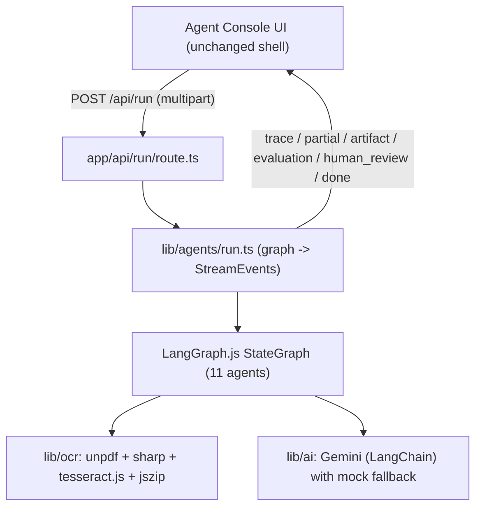
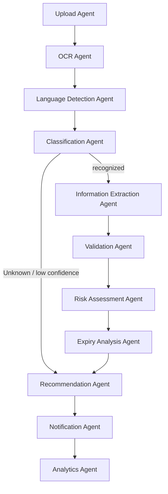

# Architecture

## Overview

A single Next.js app provides both the UI (the reusable-web-ui Agent Console shell) and the API. The browser POSTs a multipart request to `/api/run`; the route handler runs an 11-agent LangGraph.js workflow and streams the results back as NDJSON events that the shell renders in its trace / artifact / evaluation / human-review panels.

## The 11 agents (LangGraph `StateGraph`)

Shared, typed state threads through the nodes. Each node updates its slice of state and appends safe **trace** steps. Node names carry a `_step` suffix because LangGraph forbids node names that collide with state channel names.

1. **Upload** — validates intake, counts files.
2. **OCR** — expands ZIPs, extracts text (digital PDF via `unpdf`; images via Tesseract.js with `sharp` preprocessing and an automatic binarized retry on low confidence), and runs a heuristic prompt-injection scan.
3. **Language Detection** — detects language and (for non-English) requests a translation.
4. **Classification** — assigns a document type + confidence.
5. **Extraction** — pulls structured fields (Zod-validated).
6. **Validation** — completeness, expiry presence, authority recognition, format, tampering indicators → a validation status.
7. **Risk Assessment** — authenticity risk score 0–100 + anomalies.
8. **Expiry Analysis** — deterministic days-remaining + 30/60/90-day windows.
9. **Recommendation** — HR recommendation + reasoning + human-review flag.
10. **Notification** — derives alerts and the human-review signal.
11. **Analytics** — assembles the final `work_permit` artifact + evaluation, blends an overall confidence score.

### Conditional routing & error recovery

- After **Classification**, `routeAfterClassify` sends `Unknown`/low-confidence documents straight to **Recommendation** (skipping extraction/validation/risk), yielding a safe "Unable to Verify".
- The **OCR** agent retries internally with a binarized image when confidence is low.
- Every Gemini call is wrapped so failures (network/schema) fall back to the deterministic heuristic; the whole run is wrapped so any exception becomes one safe `error` event followed by `done`.

## Hybrid AI (Gemini + mock)

`lib/ai/agents.ts` is the hybrid boundary. When `GOOGLE_API_KEY` is set (and `FORCE_MOCK` is not), each agent calls Gemini through LangChain with a strict JSON prompt and validates the response with a Zod schema (`lib/ai/schemas.ts`). Otherwise — or on any failure — it uses `lib/ai/mock.ts`, which performs real regex/keyword analysis on the OCR text so the offline path is meaningful, not random.

### Hallucination & safety guards

- Structured outputs are **Zod-validated**; invalid responses are retried once, then rejected to a safe fallback.
- Prompts instruct the model to **use null when a value is not present** — no invented fields.
- Only a **safe workflow trace** is emitted; chain-of-thought is never streamed.
- A heuristic **prompt-injection scan** flags injection text in documents (treated as data).

## Streaming contract

`lib/agents/run.ts` consumes `graph.stream(..., { streamMode: "updates" })`. For each node update it emits the node's new `traces` and `partials`, and — when present — the `artifact`, `evaluation`, and a `human_review` event (only when required). It always finishes with `done`. `lib/stream.ts` encodes events as newline-delimited JSON, exactly what the shell's `parseEventStream` expects.

## State channels (`lib/agents/state.ts`)

`files`, `message`, `imageDataUrls`, `sourceNames`, `ocr`, `language`, `classification`, `extraction`, `validation`, `risk`, `expiry`, `recommendation`, `artifact`, `evaluation`, `humanReview`, `usedAi`, `injectionDetected`, and accumulators `traces` / `partials` / `warnings` / `errors`.
