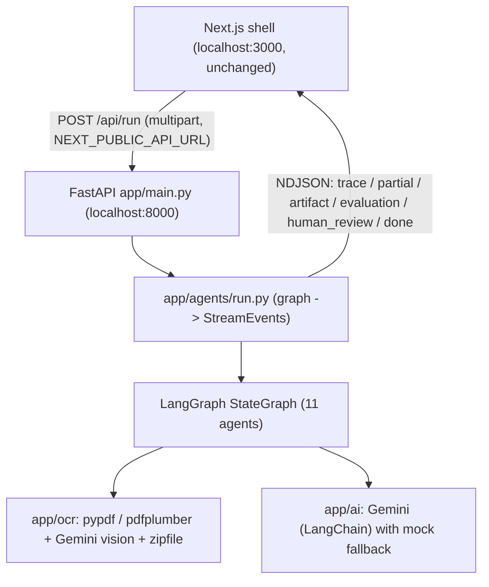
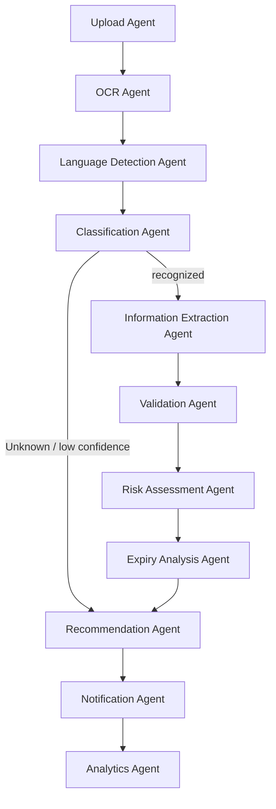

# Architecture

## Overview

Two local processes. The **Next.js shell** (reusable-web-ui Agent Console) runs on `localhost:3000` and POSTs a multipart request to the **Python FastAPI backend** on `localhost:8000`. FastAPI runs an 11-agent LangGraph workflow and streams the results back as NDJSON events that the shell renders in its trace / artifact / evaluation / human-review panels.

## The 11 agents (LangGraph `StateGraph`)

Shared, typed state threads through the nodes. Each node updates its slice of state and appends safe **trace** steps. Node names carry a `_step` suffix because LangGraph forbids node names that collide with state channel names (e.g. `ocr`, `risk`, `expiry`).

1. **Upload** — validates intake, counts files.
2. **OCR** — expands ZIPs, extracts text (digital PDF via `pypdf`, falling back to `pdfplumber`; images via **Gemini vision** with `Pillow` preprocessing), and runs a heuristic prompt-injection scan.
3. **Language Detection** — detects language and (for non-English) requests a translation.
4. **Classification** — assigns a document type + confidence.
5. **Extraction** — pulls structured fields (Pydantic-validated).
6. **Validation** — completeness, expiry presence, authority recognition, format, tampering indicators → a validation status.
7. **Risk Assessment** — authenticity risk score 0–100 + anomalies.
8. **Expiry Analysis** — deterministic days-remaining + 30/60/90-day windows.
9. **Recommendation** — HR recommendation + reasoning + human-review flag.
10. **Notification** — derives alerts and the human-review signal.
11. **Analytics** — assembles the final `work_permit` artifact + evaluation, blends an overall confidence score.

### Conditional routing & error recovery

- After **Classification**, `route_after_classify` sends `Unknown`/low-confidence documents straight to **Recommendation** (skipping extraction/validation/risk), yielding a safe "Unable to Verify".
- Every Gemini call is wrapped so failures (network/schema) fall back to the deterministic heuristic; the whole run is wrapped so any exception becomes one safe `error` event followed by `done`.

## Hybrid AI (Gemini + mock)

`app/ai/agents.py` is the hybrid boundary. When `GOOGLE_API_KEY` is set (and `FORCE_MOCK` is not), each agent calls Gemini through LangChain (`ChatGoogleGenerativeAI.with_structured_output(Model)`) with a strict JSON prompt, validated by a Pydantic schema (`app/ai/schemas.py`). Otherwise — or on any failure — it uses `app/ai/mock.py`, which performs real regex/keyword analysis on the OCR text so the offline path is meaningful, not random.

### Hallucination & safety guards

- Structured outputs are **Pydantic-validated**; invalid responses are retried once, then rejected to a safe fallback. Enum-like fields are snapped to allowed values (`coerce_enum`).
- Prompts instruct the model to **use null when a value is not present** — no invented fields.
- Only a **safe workflow trace** is emitted; chain-of-thought is never streamed.
- A heuristic **prompt-injection scan** flags injection text in documents (treated as data).
- CORS is restricted to the local frontend origin; the Gemini key never leaves the backend.

## OCR strategy

- **Digital PDFs** (the common case): `pypdf` extracts the text layer; `pdfplumber` is a fallback for awkward layouts. Fast, lossless, fully offline.
- **Images** (photos/scans): sent to **Gemini vision** for transcription, with light `Pillow` preprocessing (EXIF auto-orient, grayscale, autocontrast). This needs an API key — by design, offline image OCR is unavailable and returns an explanatory note.
- **ZIP archives**: expanded with the stdlib `zipfile`, filtered to supported types (junk/metadata like `__MACOSX`/dotfiles ignored).
- **Multi-file / multi-page**: `run_ocr_many` merges results, weighting confidence by page so a single bad page doesn't dominate.

## Streaming contract

`app/agents/run.py` consumes `graph.astream(..., stream_mode="updates")`. For each node update it emits the node's new `traces` and `partials`, and — when present — the `artifact`, `evaluation`, and a `human_review` event (only when required). It always finishes with `done`. `app/stream.py` encodes events as newline-delimited JSON, exactly what the shell's `parseEventStream` expects, served via FastAPI `StreamingResponse` with `X-Accel-Buffering: no`.

## State channels (`app/agents/state.py`)

`files`, `message`, `image_data_urls`, `source_names`, `ocr`, `language`, `classification`, `extraction`, `validation`, `risk`, `expiry`, `recommendation`, `artifact`, `evaluation`, `human_review`, `used_ai`, `injection_detected`, and list-accumulator channels `traces` / `partials` / `warnings` / `errors` (concatenated via `operator.add` reducers).
